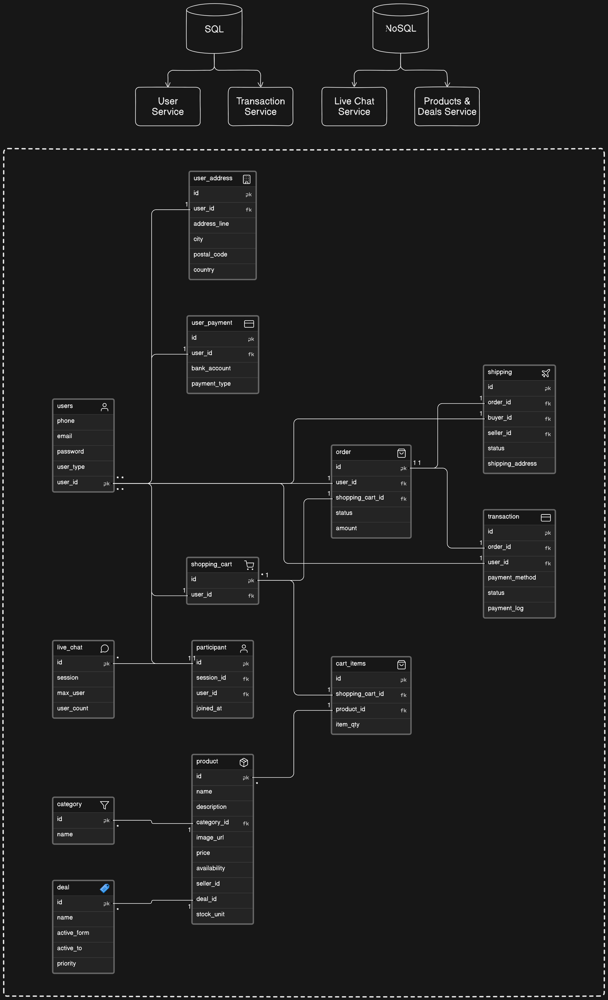
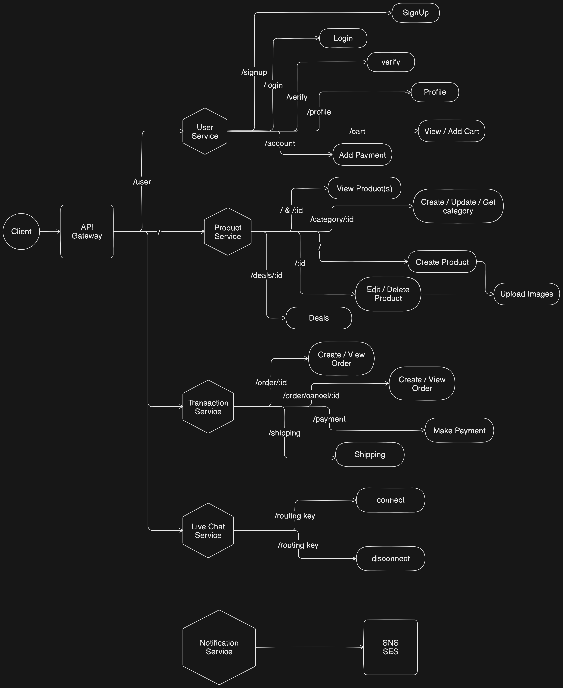
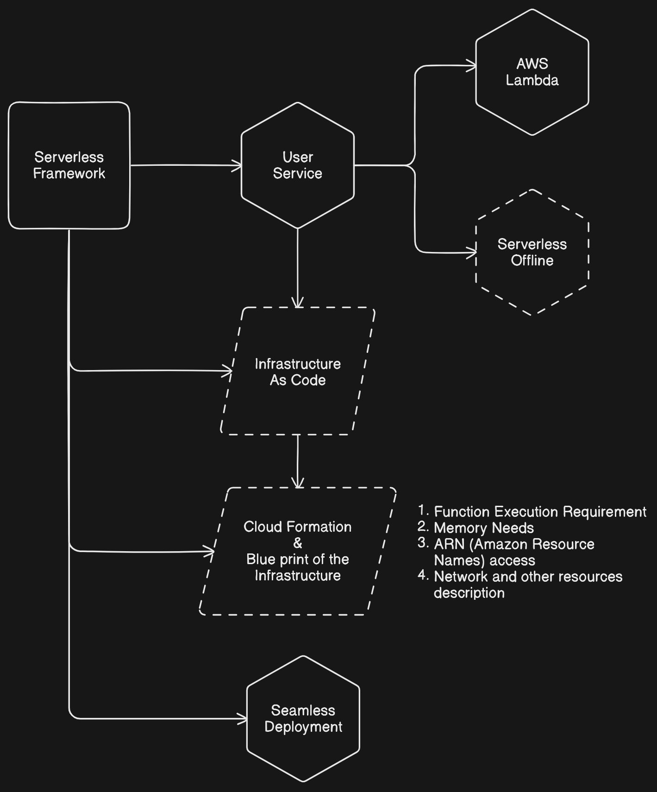
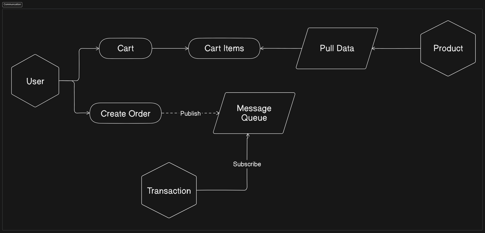

# resale_hub_microservices

- Resale Product Platform
- Sell, Buy and Advertise products
- Rate your experience
- Easily communicate will the seller
- Get notified for every process

## System Design and Code Architecture

- Functional requirements
- Non Functional requirements
- Data storage requirements

### Functional Requirements

- User Sign-up / Login functionality
- User verification with OTP / SMS
- User can become seller / buyer
- Seller can create / update / delete products
- Seller can advertise products
- Buyer can purchase using online payment
- Seller can receive payment
- Email / Message notification
- Online chat with Seller & Buyer

### Non Functional Requirements

- System should be highly available in cloud with multiple region because this is C2C portal
- System should maintain best practices to be able to scale horizontally at any level
- System should design the way that can be broken down to microservices
- Loosely coupled services and communications
- It should have mechanism for logging and monitoring to inspect services health and availability
- System should be designed with documentation for better scope of usability
- Should follow CQRS

### Data Storage Requirements

- Should be consistent or eventually consistent
- Should follow CAP theorem (Consistency, Availability, and Partition Tolerance)
- Distributed database system and high availability
- High availability of Object Storge for multiple regions

<br/><br/>

## **Project Architecture**

### Backend and Frontend Design

- This will follow a serverless approach
- The services will be divided into multiple microservices


### Database Design



### Service Endpoints



### Serverless Framework

- Reduce Overhead
- Deploy whole application in one go
- All endpoints and function can be declared in the infrastructure.
- Focus purely on building services instead of other infrastructure stuff



#### Advantages

1. **No Server Management:** As the name suggests, serverless architecture eliminates the need for server system administration. The cloud provider handles the runtime environment and server resources.
2. **Auto-Scaling:** Serverless architecture can automatically scale to accommodate traffic patterns. If a function becomes extremely popular, the serverless architecture can automatically allocate resources to handle the increased load.
3. **Built-in High Availability and Fault Tolerance:** Cloud providers automatically manage serverless function availability. If a function fails, the provider can automatically shift resources to keep it running.
4. **Faster Time to Market:** Serverless architecture can speed up the software development process. Developers can focus on writing the code that delivers value to the business, rather than managing and operating servers.
5. **Event-Driven and Instant Scale:** Serverless architectures are designed to process individual requests, making them ideal for parallel workloads, real-time file processing, and other event-driven scenarios.
6. **Reduced Latency:** Serverless allows you to run your code closer to your users by deploying your function across multiple regions around the world. This reduces latency and improves user experience.
7. **Microservices Friendly:** Serverless is a natural fit for microservices architecture, as it allows you to deploy, scale, and manage each microservice independently.

<br/><br/>

## **Implementing User Service**

- Install AWS and Serverless cli globally
- Setup a 'AWS - Node.js - HTTP API' template using command: `serverless` and setup user-service
- Install serverless-offline and serverless-typescript to run on local system using command in user-service:

```bash
serverless plugin install --name serverless-offline

serverless plugin install --name serverless-plugin-typescript
```

- Now, we can create routes by using route handlers and binding them to the `serverless.yml` file functions. So, on spinning up the serverless server, when we request for a specific route, it calls that bound route handler function and returns the results according to the method specified.

`serverless.yml`

```yml
# --- Rest of the code --- #
functions:
  signup:
    handler: app/handler.Signup
    events:
      - httpApi:
          path: /signup
          method: get
```

`handler.ts`

```ts
import { APIGatewayProxyEventV2 } from "aws-lambda";

export const Signup = async (event: APIGatewayProxyEventV2) => {
  console.log(event);
  // Application business logic

  return {
    statusCode: 200,
    headers: {
      "Access-Control-Allow-Origin": "*"
    },
    body: JSON.stringify({
      message: "response from user-service Signup handler",
      data: {}
    })
  };
};
```

### Implementing all services, routes and database inside User Service

- The user-service has multiple routes and handlers, which means we can't put all routes along with their business login in one file.
- So, AWS Lambda takes the specific output from some other files where all business logic and service is going to be executed and those files will return the specific output to the handler functions.

### Deployment

- Set new rules an parameters in the `serverless.yml` file
- Setup a new user in AWS IAM Portal, set Access Key and Administrator Access.
- Now configure AWS access key and secret access key with `aws configure`
- Deploy using serverless!

<br/><br/>

## Implementing Product Service using AWS CDK


- Install `aws-cdk` to establish CDK pipelines and Lambda Functions to handle the microservice.
- Then , bootstrap your CDK, i.e., deploying stacks with the AWS CDK to dedicated AWS S3 buckets and other containers to be available to AWS CloudFormation during deployment.

```bash
cdk bootstrap aws://ACCOUNT-NUMBER/REGION
```

- To enable it, create a user in AWS in AWS IAM and set it's permission to AdministratorAccess
- Create CLI Access Key for the user in security group. And configure the user in the Command Line.

```bash
aws configure
```

- Create the product service folder and configure CDK project inside it.

```bash
cdk init app --language=typescript
```

- In the product service, that is based on the AWS CDK architecture, lambda handler functions are defined to handle the API Gateways that are defied for API route with each of their methods.
- The lambda functions takes care of the product service stack, and run all the services and routes inside the stack!

### Uploading Images from Product Service in Secure Way

- Exposing image directly from node.js uploads to public poses security risks and potential risk of running out of storage as it will grow faster.
- Hence, using a Binary Large Object Storage like S3 is the way to go!


- Only a specific Lambda function has access to the Private S3 Bucket.
- The Web App asks for a signed URL to upload the files, the lambda function will create the signed URL with certain permissions.
- After the signed URL is created, the web app can no longer interact with the product service and can directly upload to the S3 bucket.
- This also ensures that the web app cannot read the files on its own from the private Bucket and only upload via a signed URL ensuring security.
- To read image from S3, Cloud Front Distribution will distribute the files along with limited permissions to public.

### Creating Bucket Upload Lambda Function & S3 Bucket Stack

- The Image Uploader Service requests the S3 to fetch it the signed URL for uploading.
- The bucket name and other environments are set using a IAC based S3 Bucket Stack that creates a bucket automatically in the Root ProductService Stack of the CDK
- It injects the injects the Bucket configurations onto all the lambda services but grants Write permission to the Image Uploader CloudFront only!

### Granting CloudFront Stack permission to read from S3

- Create a distribution in CloudFront that connects to the newly created Bucket and follow the same steps:

  - Select the bucket to be accessed
  - Setup Origin Access Control for restricting Bucket read access to only CloudFront.
  - The distribution should only be accessible from HTTP and HTTPs ports and only GET method allowed for read only.

- Since, the S3 bucket was created automatically, there is an existing policy that restricts the Product Service Stack in the CloudFront from access to the bucket.
- So, append new policy to grant access to the existing permissions

```json
{
  "Version": "2008-10-17",
  "Id": "PolicyForCloudFrontPrivateContent",
  "Statement": [
    {
      "Sid": "AllowCloudFrontServicePrincipal",
      "Effect": "Allow",
      "Principal": {
        "Service": "cloudfront.amazonaws.com"
      },
      "Action": "s3:GetObject",
      "Resource": "arn:aws:s3:::BUCKET_NAME/*",
      "Condition": {
        "StringEquals": {
          "AWS:SourceArn": "CLOUDFRONT_ARN"
        }
      }
    }
  ]
}
```

- The Distribution Domain Name, and the Object Key Name in the Bucket can be used to access the resources publicly.

<br/><br/>

## Implementing Communication between the User, Product and Transaction services to enable Cart

Microservices communication should be

- Loosely Coupled
- Less Dependency
- CQRS
- Segregation of Read and Write Use-cases



- The user service only needs to publish a create order event for the Transaction service to validate the request and create order. The user service does not have to interact with the transaction data
- And the user can simply pull data for cart from the Product Service and does not have to interact with the product data.

<br/><br/>

## Order Create Event using SNS & SQS

<br/><br/>

## Payment Gateway Implementation

<br/><br/>

## Managing Deployment Database for User Service

Deployment Database can be implemented in two ways

- **Managed RDS**

  - Operational Excellence
    - Monitoring and alert management
    - Centralize backup
    - Log exports for longer retention
    - Event Management
  - Security
    - IAM
    - Security Group
    - Secret Manager
    - SSL enforcement
  - Performance Efficiency
    - Read replicas
    - Auto scaling
    - Serverless architecture
  - Cost
    - Standard cost tier as per AWS
    - Assigned rest of resource COST

- **Self Managed RDS**
  - Complete control of EC2 Machine
    - Setup your own per business needs
  - Security self management
    - IAM
    - Security group
    - Secret manager
    - SSL enforcement
  - Performance Efficiency [self management]
    - Read replicas / configure
    - Auto scaling / configure
  - Cost
    - EC2 running hours
    - Pay as you added resources

### Setting up Managed AWS RDS Database

- Create a standard Postgres RDS on EC2 Instance
- Keep it private and setup Security Group
- Setup the RDS database configurations for connections

### Setting up Self-Managed AWS RDS Database

- Create a EC2 instance on Ubuntu
- Add a security group for PostgreSQL
- Configure the Key Pair certificate file in the system

```bash
chmod 400 certificate.pem
```

- Connect to the EC2 instance using the Public DNS and enter the configured Ubuntu OS environment

```bash
ssh -i "cert.pem" ubuntu@ec2-ip.region.compute.amazonaws.com
```

- Update all packages
- Install PostgreSQL

```bash
sudo apt-get install postgres postgresql-contrib
```

- Login into the current user `postgres` and change the password

```bash
sudo -i -u postgres
psql
```

```sql
ALTER USER postgres WITH PASSWORD 'secure_root_password';
```

- Create a user_service role and give it login and create database access to the instance type

```sql
CREATE ROLE user_service;

ALTER ROLE user_service WITH LOGIN;

ALTER ROLE user_service WITH PASSWORD 'secure_user_password';

ALTER ROLE user_service WITH CREATEDB;
```

- Edit the listen_address in the PostgreSQL config file to

```bash
sudo vim /etc/postgresql/14/main/postgresql.conf

listen_addresses = '*'
```

- Setup host connection access for ORMs to access the database

```bash
sudo vim /etc/postgresql/14/main/pg_hba.conf

host      all      0.0.0.0/0      md5
```

- Restart PostgreSQL instance

```bash
sudo systemctl restart postgresql
service postgres status
```

- Setup connection to the RDS using the public DNS as host of the instance

