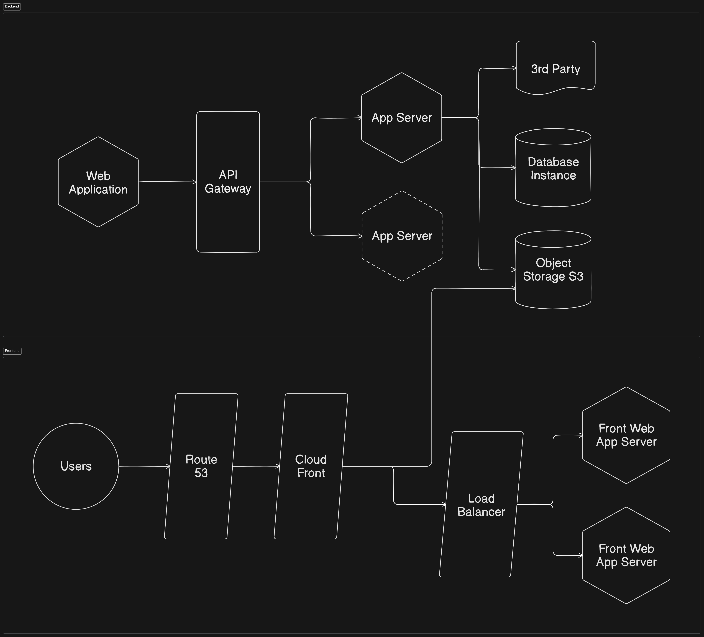
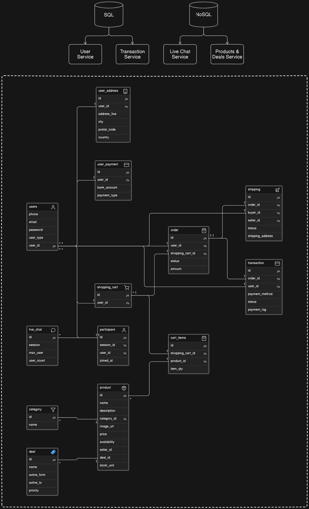
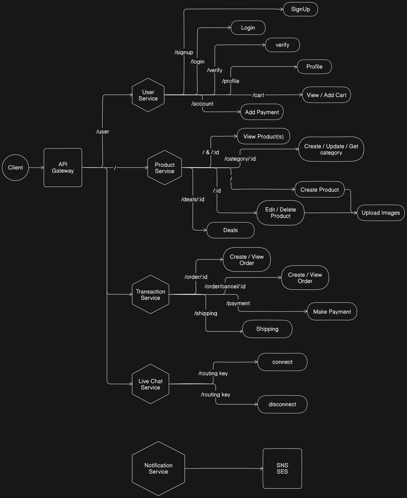
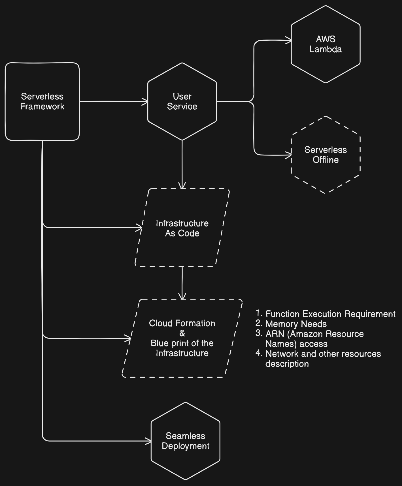

# PROJECT DOCUMENTATION

**System Design**
-

- Functional requirements
- Non Functional requirements
- Data storage requirements

### Functional Requirements
  
- User Sign-up / Login functionality
- User verification with OTP / SMS
- User can become seller / buyer
- Seller can create / update / delete products
- Seller can advertise products
- Buyer can purchase using online payment
- Seller can receive payment
- Email / Message notification
- Online chat with Seller & Buyer

### Non Functional Requirements

- System should be highly available in cloud with multiple region because this is C2C portal
- System should maintain best practices to be able to scale horizontally at any level
- System should design the way that can be broken down to microservices
- Loosely coupled services and communications
- It should have mechanism for logging and monitoring to inspect services health and availability
- System should be designed with documentation for better scope of usability
- Should follow CQRS

### Data Storage Requirements

- Should be consistent or eventually consistent
- Should follow CAP theorem (Consistency, Availability, and Partition Tolerance)
- Distributed database system and high availability
- High availability of Object Storge for multiple regions

<br/><br/>

**Project Architecture**
-

### Backend and Frontend Design

- This will follow a serverless approach
- The services will be divided into multiple microservices



### Database Design



### Service Endpoints



### Serverless Framework

- Reduce Overhead
- Deploy whole application in one go
- All endpoints and function can be declared in the infrastructure.
- Focus purely on building services instead of other infrastructure stuff



#### Advantages

1. **No Server Management:** As the name suggests, serverless architecture eliminates the need for server system administration. The cloud provider handles the runtime environment and server resources.
2. **Auto-Scaling:** Serverless architecture can automatically scale to accommodate traffic patterns. If a function becomes extremely popular, the serverless architecture can automatically allocate resources to handle the increased load.
3. **Built-in High Availability and Fault Tolerance:** Cloud providers automatically manage serverless function availability. If a function fails, the provider can automatically shift resources to keep it running.
4. **Faster Time to Market:** Serverless architecture can speed up the software development process. Developers can focus on writing the code that delivers value to the business, rather than managing and operating servers.
5. **Event-Driven and Instant Scale:** Serverless architectures are designed to process individual requests, making them ideal for parallel workloads, real-time file processing, and other event-driven scenarios.
6. **Reduced Latency:** Serverless allows you to run your code closer to your users by deploying your function across multiple regions around the world. This reduces latency and improves user experience.
7. **Microservices Friendly:** Serverless is a natural fit for microservices architecture, as it allows you to deploy, scale, and manage each microservice independently.

<br/><br/>

**Implementing User Service**
-

- Install AWS and Serverless cli globally
- Setup a 'AWS - Node.js - HTTP API' template using command:  ```serverless``` and setup user-service
- Install serverless-offline and serverless-typescript to run on local system using command in user-service: 
  
```bash
serverless plugin install --name serverless-offline

serverless plugin install --name serverless-plugin-typescript
``` 

- Now, we can create routes by using route handlers and binding them to the serverless.yaml file functions. So, on spinning up the serverless server, when we request for a specific route, it calls that binded route handler function and returns the results according to the method specified.

```serverless.yml```
```yml
# --- Rest of the code --- #
functions:
  signup:
    handler: app/handler.Signup
    events:
      - httpApi:
          path: /signup
          method: get
```

```handler.ts```
```ts
import { APIGatewayProxyEventV2 } from "aws-lambda";

export const Signup = async (event: APIGatewayProxyEventV2) => {
  console.log(event);
  // Application business logic

  return {
    statusCode: 200,
    headers: {
      "Access-Control-Allow-Origin": "*"
    },
    body: JSON.stringify({
      message: "response from user-service Signup handler",
      data: {}
    })
  };
};
```

### Implementing all services, routes and database inside User Service

- The user-service has multiple routes and handlers, which means we can't put all routes along with their business login in one file.
- So, AWS Lambda takes the specific output from some other files where all business logic and service is going to be executed and those files will return the specific output to the handler functions.

### Implementing Product Service using CDK Pipeline

- Install ```aws-cdk``` to establish CDK pipelines and Lambda Functions to handle the microservice.
- Then , bootstrap your CDK, i.e., deploying stacks with the AWS CDK to dedicated AWS S3 buckets and other containers to be available to AWS CloudFormation during deployment.
  
```bash
cdk bootstrap aws://ACCOUNT-NUMBER/REGION
```

- To enable it, create a user in AWS in AWS IAM and set it's permission to AdministratorAccess
- Create CLI Access Key for the user in security group. And configure the user in the Command Line.

```bash
aws configure
```

- Create the product service folder and configure CDK project inside it.

```bash
cdk init app --language=typescript
```


### Deployment

- Set new rules an parameters in the serverless.yml file
- Setup a new user in AWS IAM Portal, set Access Key and Administrator Access.
- Now configure AWS access key and secret access key with ```aws configure```
- Deploy using serverless!

